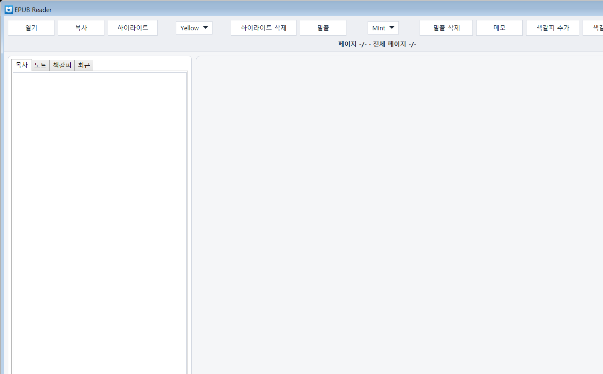
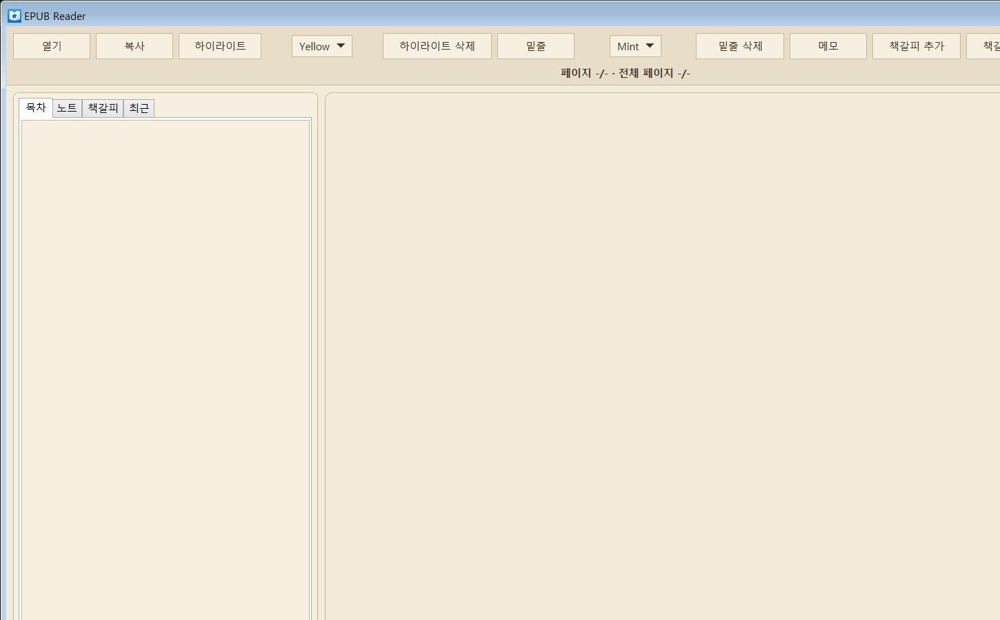
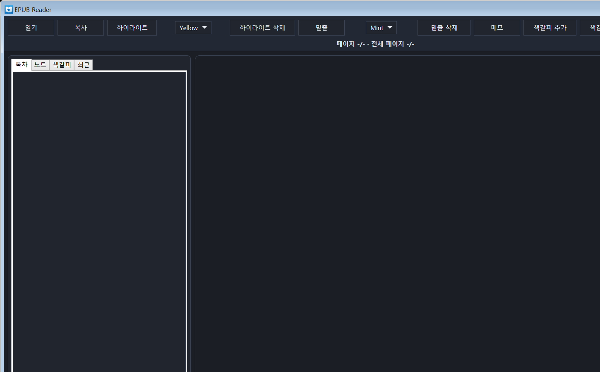

# EPUB Reader (Windows) - Binary Distribution

이 저장소는 **실행/설치용 파일만** 포함합니다. 소스코드는 포함하지 않습니다.

## 스크린샷 (책 미오픈 상태)

### Light 테마

### Sepia 테마

### Dark 테마

## 다운로드

릴리즈 자산 직링크(고정):

- `EpubReader-win-x64-portable.zip`  
  https://github.com/tz1012/epubreader/releases/download/v1.0.0-release-only/EpubReader-win-x64-portable.zip

릴리즈 페이지:

- https://github.com/tz1012/epubreader/releases/tag/v1.0.0-release-only

## 설치/실행 방법

1. `EpubReader-win-x64-portable.zip` 다운로드
2. 원하는 폴더에 압축 해제
3. 압축 해제 폴더에서 `EpubReader.Win.exe` 실행

## 시스템 요구사항

- OS: Windows 10/11 (x64)
- 런타임: **.NET Desktop Runtime 8.0 (x64)**
  - 미설치 시: https://dotnet.microsoft.com/download/dotnet/8.0

## 포함 파일

- `downloads/EpubReader-win-x64-portable.zip`
- `screenshots/theme-light.png`
- `screenshots/theme-sepia.png`
- `screenshots/theme-dark.png`

## 무결성 (SHA-256)

- 파일: `EpubReader-win-x64-portable.zip`
- SHA-256: `1AF6EEFA23A1BF6C0E14E6385ADA757FA05A866DB4301334D113D2B4CF91CD61`
- 크기: `2,805,767 bytes`
- 빌드 날짜: `2026-02-26`

## 업데이트 방법

1. 최신 릴리즈 zip 재다운로드
2. 기존 폴더를 백업 후 새 zip으로 교체
3. `EpubReader.Win.exe` 재실행
